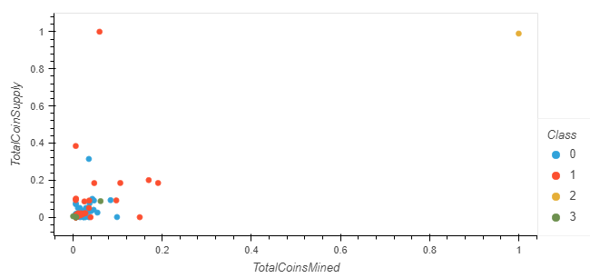

# Cryptocurrency Analysis
## Project Overview
The purpose of this project is to analyze a dataset of cryptocurrencies and group them to create a classification system for cryptocurrencies currently on the trading market. The data was cleaned and preprocessed to ensure only crypto coins that were currently tradable and had no missing information were included, and all data was in numeric form and scaled. Then PCA was applied to produce three principal components which were plotted as an elbow curve to find the best value for K in the K-means algorithm. The K-means algorithm was used to sort the cryptocurrencies into four clusters, and these clusters were visualized in a scatter plot.

